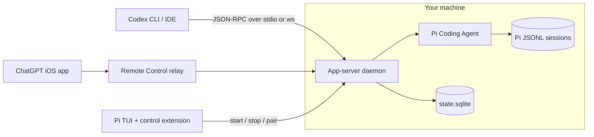

# pi-codex-app-server

> **Published fork.** This is `pi-codex-app-server` 0.1.1 (Apache-2.0, [Lqm1](https://github.com/Lqm1)) as forked from
> [`Lqm1/pi-codex-app-server@81f9d1b`](https://github.com/Lqm1/pi-codex-app-server/tree/81f9d1b1de2e942bc65df8cd830d10cf3d5a1340).
> It stays Apache-2.0, keeps the upstream [`LICENSE`](LICENSE), and vendors OpenAI's Apache-2.0 Codex
> app-server protocol snapshot. Changes from upstream: no build step (sources run as TypeScript), pi's
> packages come from the host install instead of a bundled copy, autostart defaults **off**, and the
> test suite runs on `node:test`. Never install both this package and the upstream one at once, or two
> daemons fight over the same state directory. See [docs/fork-notes.md](docs/fork-notes.md).

[](LICENSE) [](https://nodejs.org) [](https://pi.dev)

Talk to [Pi Coding Agent](https://pi.dev) from anything that speaks the Codex app-server protocol: the Codex CLI, Codex IDE extensions, and the ChatGPT mobile app over Remote Control.

This is an adapter, not a Codex reimplementation. Pi still picks the models, runs the tools, enforces the permissions, and owns the session history. This project speaks Codex JSON-RPC on one side, calls Pi on the other, and keeps a small SQLite sidecar for the handful of things Codex clients expect that Pi has no concept of, such as project catalogs and archived threads.

## Features

- **Two transports.** Run it over stdio for a local Codex client, or as a background daemon on a WebSocket port that survives Pi session changes and extension reloads.
- **Connected host for ChatGPT.** Enroll with OpenAI Remote Control, show a QR code in the Pi TUI, and drive your machine from the ChatGPT iOS app.
- **The Pi models you choose to expose.** `model/list` returns Pi's model registry filtered by a glob (`PI_CODEX_APP_SERVER_MODELS`, default `cpa/*`), with the reasoning levels each model actually supports, and a default you set. A slug this server does not offer resolves to that default instead of failing the request.
- **Pi history, projected on demand.** Pi's JSONL sessions stay the source of truth. Threads, turns, and items are computed from them when a client asks.
- **One credential.** Pi owns the OpenAI OAuth token. This server borrows it and routes logout back through Pi, so two stores never rotate the same refresh token.
- **No `Method not found`.** Codex methods without a Pi equivalent return schema-valid neutral results, validated by Ajv against the official Codex JSON Schemas.
- **Controlled from inside Pi.** A `/codex-server` command starts, stops, inspects, and pairs the daemon without leaving the TUI.

## How it works



The daemon accepts Codex JSON-RPC connections and dials out to the Remote Control relay at the same time, so a paired phone and a local Codex client share the same sessions. A Pi session only ever has one writer, and today that writer is the daemon. The lease table in SQLite is there for the next step, handing ownership to an active Pi TUI so the two never rewrite the same JSONL at once. See [ADR 0009](docs/adr/0009-use-a-single-writer-for-shared-sessions.md).

## Getting started

### Prerequisites

- [Node.js](https://nodejs.org) 22.19 or newer, for the type stripping that runs the sources unbuilt. The metadata store uses `node:sqlite`, so Node 24 is the smoother choice and drops the experimental warning.
- [Pi Coding Agent](https://pi.dev) installed and logged in. The daemon resolves pi's own packages out of that install, so it always runs the same pi as the TUI that later resumes its sessions.

> [!IMPORTANT] Pairing with ChatGPT needs Pi's `openai-codex` OAuth login. Run `pi` and sign in to ChatGPT there first. An API key will not do: the enrollment call reads the account id out of the OAuth token's claims.

### Install

Install it as a Pi package:

```bash
pi install npm:@hank-warren/pi-codex-app-server
```

Pin a version with `pi install npm:@hank-warren/pi-codex-app-server@0.1.0`, or add `-l` to install into the current project instead of your global Pi setup.

Unlike upstream, the extension does **not** launch a daemon on session start. Start one deliberately —
`/codex-server start`, a systemd unit, or `PI_CODEX_APP_SERVER_AUTOSTART=1` — and the status appears in the footer:

```
Codex server: running · ws://127.0.0.1:53412
```

### Pair with ChatGPT

Inside Pi:

```
/codex-server pair
```

Scan the QR code with the ChatGPT app, or type the manual code it prints underneath. Codes expire, and the widget shows when.

### Connect a local Codex client

The package ships a `pi-codex-app-server` binary that runs straight from TypeScript source. Install it on your `PATH` if a client needs to spawn it directly:

```bash
npm install -g @hank-warren/pi-codex-app-server
```

It finds pi through the `pi` on your `PATH`; set `PI_CODEX_APP_SERVER_PI_ROOT` to the
`@earendil-works/pi-coding-agent` directory when pi is installed somewhere that binary cannot see (a
systemd unit with a trimmed `PATH`, for instance).

Then point any Codex-compatible client at it and let the client own stdio:

```bash
pi-codex-app-server app-server
```

Or attach to the shared daemon over WebSocket. `/codex-server status` prints the URL, and it is also in `endpoint.json`.

## The `/codex-server` command

| Subcommand | What it does |
| --- | --- |
| `start` | Spawn the daemon if it is not already running, then wait for it to be reachable |
| `stop` | `SIGTERM` the daemon and remove the endpoint file |
| `status` | Default. PID, WebSocket URL, start time, autostart and Remote Control flags, current Pi session id, file paths |
| `pair` | Request a ChatGPT Remote pairing code and render it as a QR code |

## CLI

```
pi-codex-app-server [command]
```

| Command | What it does |
| --- | --- |
| _(none)_ | Same as `app-server` |
| `app-server` | Serve the Codex app-server protocol over stdio |
| `daemon` | Listen on WebSocket, write `endpoint.json`, print the URL, and connect the Remote Control relay |
| `pair` | Print a pairing code and its expiry, then exit |

Logs go to stderr as JSON Lines. Email addresses and JWTs are redacted on the way out.

## Configuration

Everything is environment variables. The config is parsed with Zod at startup, so a bad value fails loudly instead of silently defaulting.

| Variable | Default | Purpose |
| --- | --- | --- |
| `PI_CODEX_APP_SERVER_AUTOSTART` | `0` | Set `1` to let the extension launch the daemon on session start. Upstream defaults this on; here the host decides (see [docs/fork-notes.md](docs/fork-notes.md)) |
| `PI_CODEX_APP_SERVER_HOME` | `<pi agent dir>/codex-app-server` | Where state, the endpoint file, and logs live |
| `PI_CODEX_APP_SERVER_HOST_NAME` | machine hostname | Name this connected host reports |
| `PI_CODEX_APP_SERVER_LISTEN` | `ws://127.0.0.1:0` | Daemon listen URL. Port `0` picks a free one |
| `PI_CODEX_REMOTE_CONTROL` | `1` | Set `0` to run purely local and skip enrollment |
| `PI_CODEX_REMOTE_BASE_URL` | `https://chatgpt.com/backend-api/` | Remote Control API base, useful for testing |
| `PI_CODEX_APP_SERVER_PI_ROOT` | resolved from `pi` on `PATH` | The `@earendil-works/pi-coding-agent` directory the daemon borrows pi from |
| `PI_CODEX_APP_SERVER_MODELS` | `cpa/*` | Comma-separated globs over `provider/model`. Only matching models are offered |
| `PI_CODEX_APP_SERVER_DEFAULT_MODEL` | `cpa/claude-opus-5` | The model a client gets when it names none, or names one that is not offered |

### Which models a client sees

Upstream returns Pi's whole registry. This fork scopes it, because a Codex client
renders one flat picker with no provider grouping, and because the picker is the
place where an account gets chosen by accident.

`*` matches within one slash-separated segment and `**` matches across them, so
the default `cpa/*` means CLIProxyAPI's own models and *not* its account-pinned
aliases (`cpa/plus%2Fgpt-5.5`, `cpa/team%2Fgpt-5.6-luna`): CLIProxyAPI's
round-robin, session affinity and quota failover pick the account, and a pinned
slug in the picker would take that decision away from it. Ask for them
deliberately with `cpa/plus/*`, or take everything with `cpa/**`.

A slug this server does not offer is not an error. The ChatGPT app's background
helper starts threads with bare Codex slugs such as `gpt-5.4-mini`, which name no
Pi provider at all; those, and any excluded or unknown model, resolve to
`PI_CODEX_APP_SERVER_DEFAULT_MODEL`. A glob that matches nothing falls back to
the full catalogue rather than leaving a client with an empty picker.

This reverses upstream's [ADR 0014](docs/adr/0014-expose-the-complete-pi-model-registry.md),
which exposed the whole registry and failed an unavailable selection outright;
[ADR 0022](docs/adr/0022-scope-the-catalog-and-fall-back-to-a-default-model.md)
records why. Set `PI_CODEX_APP_SERVER_MODELS=**` to get upstream's catalogue back.

> [!NOTE] `PI_CODEX_APP_SERVER_LISTEN` accepts `wss://`, but the daemon refuses to terminate TLS itself. Put a local proxy in front of it if you need that.

### Files on disk

Under `PI_CODEX_APP_SERVER_HOME`:

| Path | Contents |
| --- | --- |
| `state.sqlite` | Projects, thread metadata, writer leases, enrollment and pairing state. No conversation content |
| `endpoint.json` | PID, WebSocket URL, and start time of the running daemon. Written with mode `0600` |
| `logs/` | Created for the daemon. The server itself writes to stderr |

## Protocol coverage

Built against the vendored Codex app-server protocol v2 schemas in [vendor/openai-codex-app-server-protocol/](vendor/openai-codex-app-server-protocol/), tracking Codex `0.149.0`. The method map in [src/protocol/generated/codex-methods.ts](src/protocol/generated/codex-methods.ts) is generated from the official request definitions, so method names, params, and responses line up at compile time.

Implemented today:

- Lifecycle: `initialize`, `initialized`, `account/read`, `account/logout`, `model/list`, `modelProvider/capabilities/read`
- Threads: `thread/list`, `thread/read`, `thread/start`, `thread/resume`, `thread/loaded/list`, `thread/name/set`, `thread/compact/start`, `thread/archive`, `thread/unarchive`, `thread/delete`, `thread/unsubscribe`
- Turns: `turn/start`, `turn/steer`, `turn/interrupt`
- Streaming notifications: `thread/started`, `thread/name/updated`, `turn/started`, `turn/completed`, `item/started`, `item/completed`, `item/agentMessage/delta`, `item/reasoning/textDelta`

Two details worth knowing if you are reading the wire. Codex omits the `"jsonrpc":"2.0"` member, so this server adds it only while a message is inside the `json-rpc-2.0` library and strips it before sending. Cancellation is the protocol-level `turn/interrupt` request, not `$/cancelRequest`.

> [!WARNING] Codex-only settings such as sandbox mode and approval policy are accepted and then ignored. Sessions run with Pi's execution semantics, and the server reports Pi's effective state back. It will not invent a security guarantee it cannot enforce. If you rely on Codex sandboxing, this is not a drop-in replacement.

Archiving is metadata-only and leaves the Pi JSONL alone. `thread/delete` is not: it deletes the Pi session file for real, matching Codex semantics.

## Platform support

Upstream targets Windows x64 first, then macOS, and calls Linux experimental because ChatGPT Remote documents Windows and macOS hosts ([ADR 0008](docs/adr/0008-support-windows-and-macos-hosts-first.md)).

This fork runs on **Linux aarch64** (Ubuntu 24.04, Node 24) as a systemd service, which is what it is developed and exercised against: enrolment, pairing, the relay and phone-driven turns all work there. The relay is an outbound WebSocket and the transport is portable, so nothing in the protocol cares about the host platform; the caveat is about what ChatGPT documents, not about what connects. Windows and macOS are untested *here* — the inverse of upstream's position.

## Development

This package lives in the [pi-extensions](../..) monorepo and follows its rules: no build step, no
`dist/`, sources loaded as TypeScript. From the repository root:

```bash
npm test            # structure validation, typecheck, smoke load, node:test suites
npm run test:pkg -- "packages/pi-codex-app-server/test/*.test.ts"   # this package only
```

The suite was ported from vitest to `node:test` through a small compatibility shim in
[test/support/vitest-compat.ts](test/support/vitest-compat.ts), so the test files stay diffable
against upstream.

### Layout

```
index.ts                 Pi extension entrypoint (re-exports src/extension/)
bin/                     Standalone daemon/CLI launcher and pi-resolution hooks
src/
  cli.ts                 Entry point, wires commands to config
  server/                AppServer, method registration, stdio and daemon runners
  pi/                    Pi adapter: model catalog, live sessions, history projection
  protocol/              JSON-RPC connection, generated method map, Ajv validation
  remote/                Remote Control enrollment, pairing, relay transport
  transports/            stdio and WebSocket message transports
  storage/               SQLite metadata sidecar
  extension/             Pi extension: /codex-server command and daemon control
scripts/                 Protocol method-map codegen
drizzle/                 Generated SQLite migrations
vendor/                  Official Codex protocol schemas and generated types
docs/adr/                Why things are the way they are
```

The [ADRs](docs/adr/) are short and worth skimming before you change behavior. They cover the decisions that are easy to undo by accident, such as who owns credentials, why the daemon is separate from the extension, and why the adapter never rewrites a model request.

## Troubleshooting

**The footer says "startup failed".** Run `/codex-server status` for the details. A stale `endpoint.json` pointing at a dead PID reads as stopped and the next `start` overwrites it, so the more likely cause is the port in `PI_CODEX_APP_SERVER_LISTEN` already being taken. The daemon also has 10 seconds to become reachable before the extension gives up.

**Pairing fails with "requires Pi OpenAI OAuth login".** Pi has no `openai-codex` credential. Sign in to ChatGPT from Pi and try again.

**The daemon starts but the phone never connects.** Check `PI_CODEX_REMOTE_CONTROL` is not `0`. The relay reconnects with backoff from 1s up to 30s, so give it a moment after a network drop.

**A model the client shows does not work.** Selections go to Pi unchanged and fail loudly when unavailable, on purpose. Confirm the provider is configured in Pi with `pi` itself first.

## Related

- [Pi Coding Agent](https://pi.dev) and its [extension docs](https://github.com/badlogic/pi-mono)
- [openai/codex](https://github.com/openai/codex), the behavioral reference for the app-server protocol
- [docs/CONTEXT.md](docs/CONTEXT.md) for the vocabulary this codebase uses and the terms it deliberately avoids
